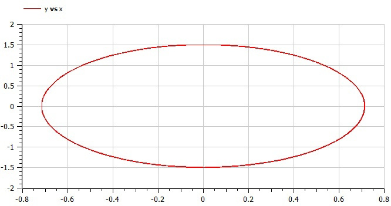
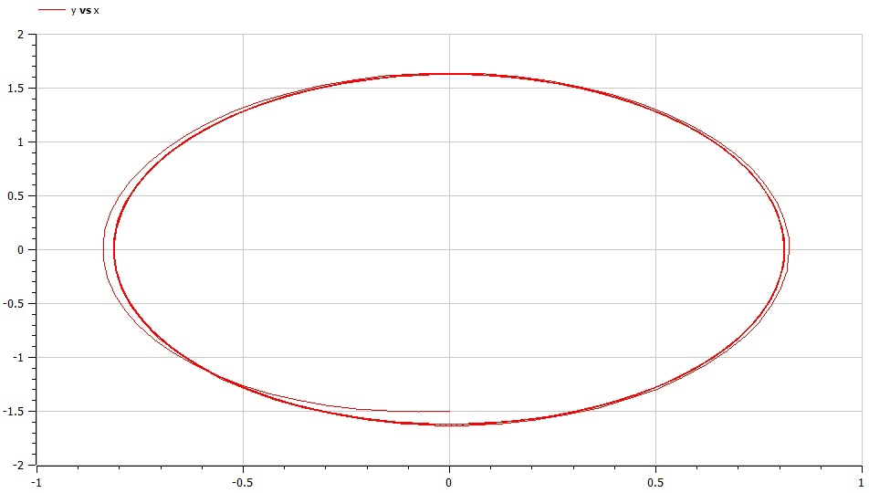

---
# Front matter
lang: ru-RU
title: Защита лабораторной работы №4. Моделирование гармонических колебаний
author: "Бурдина Ксения Павловна"
group: NFIbd-01-19
institute: RUDN University, Moscow, Russian Federation
date: 2022 Mar 02th

# Formatting
toc: false
slide_level: 2
header-includes: 
 - \metroset{progressbar=frametitle,sectionpage=progressbar,numbering=fraction}
 - '\makeatletter'
 - '\beamer@ignorenonframefalse'
 - '\makeatother'
aspectratio: 43
section-titles: true
theme: metropolis

---

# Результат выполнения лабораторной работы №4

# Цель выполнения лабораторной работы 

## Цель выполнения лабораторной работы

Необходимо научиться выполнять построение математической модели гармонических колебаний. Нужно рассмотреть задачу о колебаниях гармонического осциллятора с учетом возможных затуханий и действий внешней силы.

# Задачи выполнения лабораторной работы

## Задачи выполнения лабораторной работы

1. Провести рассуждения и записать дифференциальные уравнения колебаний гармонического осциллятора;

2. Построить фазовый портрет модели колебаний без затуханий и без действий внешней силы;

3. Построить фазовый портрет модели колебаний с затуханием и без действий внешней силы;

4. Построить фазовый портрет модели колебаний с затуханием и под действием внешней силы.

# Уравнения

## Уравнения

Начальные условия:
$$x_0 = 0$$
$$y_0 = -1.5$$

Интервал: $t\in[0;53]$

Общее уравнение для случая 1:
$$\frac{\partial^2x}{\partial t^2} + 4.4x = 0$$

## Уравнения

Общее уравнение для случая 2:
$$\frac{\partial^2x}{\partial t^2} + 2.5\frac{\partial x}{\partial t} + 4x = 0$$

Общее уравнение для случая 3:
$$\frac{\partial^2x}{\partial t^2} + 2\frac{\partial x}{\partial t} + 3.3x = 3.3cos(2t)$$

# Результат выполнения лабораторной работы

## Результат выполнения лабораторной работы

Модель колебаний гармонического осциллятора без затуханий и без действий внешней силы

{width=90%}

## Результат выполнения лабораторной работы

Модель колебаний гармонического осциллятора с затуханием и без действий внешней силы

{width=90%}

## Результат выполнения лабораторной работы

Модель колебаний гармонического осциллятора с затуханием и под действием внешней силы

{width=80%}

# Вывод

## Вывод

- Провели рассуждения и выполнили построение математической модели для решения задачи о гармонических колебаниях на примере задачи о колебаниях гармонического осциллятора;

-  Получили дифференциальные уравнения, на основе которых решили задачу о колебаниях гармонического осциллятора;

- Построили фазовые портреты колебаний гармонического осциллятора для каждого представленного случая.

