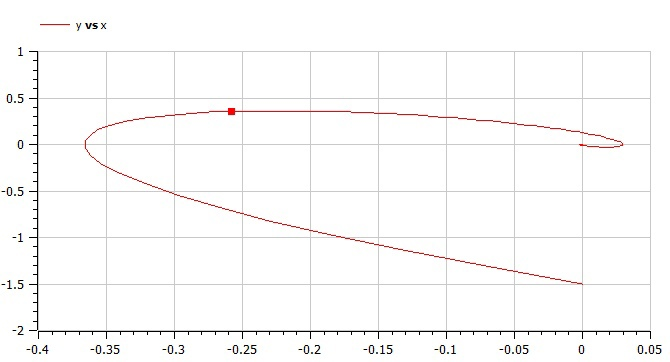

---
# Front matter
title: "Отчет по лабораторной работе №4"
subtitle: "Модель гармонических колебаний"
author: "Бурдина Ксения Павловна"
group: NFIbd-01-19
institute: RUDN University, Moscow, Russian Federation
date: 2022 Mar 02th

# Generic otions
lang: ru-RU
toc-title: "Содержание"

# Bibliography
csl: pandoc/csl/gost-r-7-0-5-2008-numeric.csl

# Pdf output format
toc: true # Table of contents
toc_depth: 2
lof: true # List of figures
lot: true # List of tables
fontsize: 12pt
linestretch: 1.5
papersize: a4
documentclass: scrreprt
### Fonts
mainfont: PT Serif
romanfont: PT Serif
sansfont: PT Sans
monofont: PT Mono
mainfontoptions: Ligatures=TeX
romanfontoptions: Ligatures=TeX
sansfontoptions: Ligatures=TeX,Scale=MatchLowercase
monofontoptions: Scale=MatchLowercase,Scale=0.9
## Biblatex
biblatex: true
biblio-style: "gost-numeric"
biblatexoptions:
  - parentracker=true
  - backend=biber
  - hyperref=auto
  - language=auto
  - autolang=other*
  - citestyle=gost-numeric
## Misc options
indent: true
header-includes:
  - \linepenalty=10 # the penalty added to the badness of each line within a paragraph (no associated penalty node) Increasing the value makes tex try to have fewer lines in the paragraph.
  - \interlinepenalty=0 # value of the penalty (node) added after each line of a paragraph.
  - \hyphenpenalty=50 # the penalty for line breaking at an automatically inserted hyphen
  - \exhyphenpenalty=50 # the penalty for line breaking at an explicit hyphen
  - \binoppenalty=700 # the penalty for breaking a line at a binary operator
  - \relpenalty=500 # the penalty for breaking a line at a relation
  - \clubpenalty=150 # extra penalty for breaking after first line of a paragraph
  - \widowpenalty=150 # extra penalty for breaking before last line of a paragraph
  - \displaywidowpenalty=50 # extra penalty for breaking before last line before a display math
  - \brokenpenalty=100 # extra penalty for page breaking after a hyphenated line
  - \predisplaypenalty=10000 # penalty for breaking before a display
  - \postdisplaypenalty=0 # penalty for breaking after a display
  - \floatingpenalty = 20000 # penalty for splitting an insertion (can only be split footnote in standard LaTeX)
  - \raggedbottom # or \flushbottom
  - \usepackage{float} # keep figures where there are in the text
  - \floatplacement{figure}{H} # keep figures where there are in the text
---

# Цель работы

Целью данной работы является построение математической модели гармонических колебаний на примере задачи о колебаниях гармонического осциллятора с учетом возможных затуханий и действий внешней силы.

# Задание

В ходе работы необходимо:

1. Прописать уравнения для построения моделей гармонических колебаний при условии, что $x_0 = 0$, $y_0 = -1,5$, а интервал времени колебаний принимает значения $[0;53]$.

2. Построить фазовый портрет гармонического осциллятора для модели колебаний без затуханий и без действий внешней силы.

3. Построить фазовый портрет гармонического осциллятора для модели колебаний с затуханием и без действий внешней силы.

4. Построить фазовый портрет гармонического осциллятора для модели колебаний с затуханием и под действием внешней силы.

# Теоретическое введение

Постановка задачи следующая:

Постройте фазовый портрет гармонического осциллятора и решение уравнения гармонического осциллятора для следующих случаев:
1. Колебания гармонического осциллятора без затуханий и без действий внешней силы;
2. Колебания гармонического осциллятора с затуханием и без действий внешней силы;
3. Колебания гармонического осциллятора с затуханием и под действием внешней силы.

Решение исходной задачи сводится к решению системы дифференциальных уравнений: 

$$\left\{ 
\begin{array}{c}
x(t_0) = x_0 \\ 
y(t_0) = y_0 \\ 
\end{array}
\right.$$
$$\left\{ 
\begin{array}{c}
\dot x = y \\ 
\dot y = -4.4x \\ 
\end{array}
\right.$$
в первом случае;

$$\left\{ 
\begin{array}{c}
x(t_0) = x_0 \\ 
y(t_0) = y_0 \\ 
\end{array}
\right.$$
$$\left\{ 
\begin{array}{c}
\dot x = y \\ 
\dot y = -4x - 2.5y \\ 
\end{array}
\right.$$
во втором случае;

$$\left\{ 
\begin{array}{c}
x(t_0) = x_0 \\ 
y(t_0) = y_0 \\ 
\end{array}
\right.$$
$$\left\{ 
\begin{array}{c}
\dot x = y \\ 
\dot y = -3.3x - 2y - 3.3cos(2t) \\ 
\end{array}
\right.$$
в третьем случае, с начальными условиями: 

$$\left\{ 
\begin{array}{c}
x_0 = 0 \\ 
y_0 = -1.5 \\ 
\end{array}
\right.$$

# Выполнение лабораторной работы

1. Рассмотрим модель линейного гармонического осциллятора, описываемую неким дифференциальным уравнением, которое в теории колебаний выступает в качестве основной модели. 

2. Определим уравнение свободных колебаний гармонического осциллятора [[1]](https://esystem.rudn.ru/pluginfile.php/1343889/mod_resource/content/2/%D0%9B%D0%B0%D0%B1%D0%BE%D1%80%D0%B0%D1%82%D0%BE%D1%80%D0%BD%D0%B0%D1%8F%20%D1%80%D0%B0%D0%B1%D0%BE%D1%82%D0%B0%20%E2%84%96%203.pdf). Оно имеет следующий вид: $$\ddot x + 2\gamma \dot x + w_0^2x = 0$$
причём $$\ddot x = \frac{\partial^2x}{\partial t^2}, \dot x = \frac{\partial x}{\partial t}$$
где $x$ - переменная, описывающая состояние системы, $\gamma$ - параметр, характеризующий потери энергии, $w_0$ - собственная частота колебаний, $t$ - время.

3. Заметим, что полученное уравнение - это линейное однородное дифференциальное уравнение второго порядка, которое является примером линейной динамической системы. При отсутствии потерь в системе получим уравнение консервативного осциллятора: $$\ddot x + w_0^2x = 0$$
где энергия колебания сохраняется во времени.

4. Зададим начальные условия для решения уравнения второго порядка: $$\left\{ 
\begin{array}{c}
x(t_0) = x_0 \\ 
\dot x(t_0) = y_0 \\ 
\end{array}
\right.$$
  Теперь представим уравнения второго порядка в виде системы двух уравнений первого порядка: $$\left\{
  \begin{array}{c}
  \dot x = y \\ 
  \dot y = -w_0^2x \\ 
  \end{array}
  \right.$$
  где начальными условиями будут: $$\left\{ 
  \begin{array}{c}
  x(t_0) = x_0 \\ 
  y(t_0) = y_0 \\ 
  \end{array}
  \right.$$
Здесь независимые переменные $x, y$ определяют пространство, в котором "движется" решение. Это фазовое пространство будем называть фазовой плоскостью. 

5. Заметим, что значение фазовых координат $x, y$ в любой момент времени полностью определяет состояние системы. Решению уравнения движения как функции времени отвечает гладкая кривая в фазовой плоскости. Она называется фазовой траекторией. Если множество различных решений изобразить на одной фазовой плоскости, возникает общая картина поведения системы. Такую картину, образованную набором фазовых траекторий, называют фазовым портретом.

6. Напишем программу для расчёта траектории колебаний в OpenModelica. Зададим начальное состояние системы $x_0 = 0$ и $y_0 = -1.5$. Далее запишем параметры для решения системы в первом случае, когда колебания идут без затуханий и без действий внешней силы: $w = sqrt(4.40), g = 0.00$. Установим, что переменные $x, y$ имеют начальные значения $x_0, y_0$ соответственно. Запишем функцию для расчета воздействия внешних сил и укажем, что в данном случае она будет принимать нулевое значение, так как внешние силы отсутствуют. Запишем уравнения, описывающие нашу модель для случая, когда колебания идут без затухания и без воздействия внешних сил: $$der(x) = y$$
$$der(y) = -w*w*x-g*y-f(time)$$
  

  

  Укажем, что колебания должны совершаться на интервале $t\in[0;53]$ с шагом $0.05$.

  

  В результате выполнения данной программы получаем следующий фазовый портрет колебаний гармонического осциллятора:

  

7. Напишем программу для расчёта траектории колебаний для второго случая. Начальное состояние системы остается прежним.
Параметры для решения системы во втором случае, когда колебания идут с затуханиями и без действий внешней силы: $w = sqrt(4.00), g = 2.50$. Установим, что переменные $x, y$ имеют начальные значения $x_0, y_0$ соответственно. В функции для расчета воздействия внешних сил оставляем нулевое значение, так как внешние силы отсутствуют. Уравнения, описывающие нашу модель, остаются прежними: $$der(x) = y$$
$$der(y) = -w*w*x-g*y-f(time)$$
  

  

  В результате выполнения данной программы получаем следующий фазовый портрет колебаний гармонического осциллятора:

  

8. Напишем программу для расчёта траектории колебаний для третьего случая. Начальное состояние системы остается прежним.
Параметры для решения системы в тертьем случае, когда колебания идут с затуханиями и под действием внешней силы: $w = sqrt(3.30), g = 2.00$. Установим, что переменные $x, y$ имеют начальные значения $x_0, y_0$ соответственно. В функции для расчета воздействия внешних сил указываем их значение: $3.3*cos(2*t)$. Уравнения, описывающие нашу модель, остаются прежними: $$der(x) = y$$
$$der(y) = -w*w*x-g*y-f(time)$$
  

  

  В результате выполнения данной программы получаем следующий фазовый портрет колебаний гармонического осциллятора:

  

# Выводы

В процессе выполнения работы мы построили модель гармонических колебаний на примере задачи колебаний гармонического осциллятора. Получили дифференциальные уравнения для построения модели на заданном временном промежутке с учетом начального состояния системы. Мы решили уравнения и построили фазовый портрет гармонического осциллятора для случая, когда колебания проходят без затуханий и без действий внешней силы, для случая, когда колебания проходят с затуханием и без действий внешней силы, а также для случая, когда колебания проходят с затуханием и под действием внешней силы.

# Список литературы

1. Методические материалы курса "Математическое моделирование".

2. Паршин Д. А., Зегря Г. Г. "Колебания". СПб: 28 с.